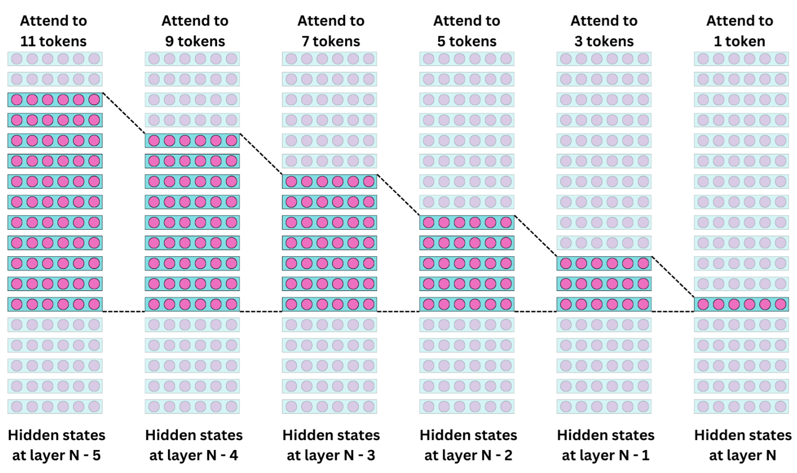
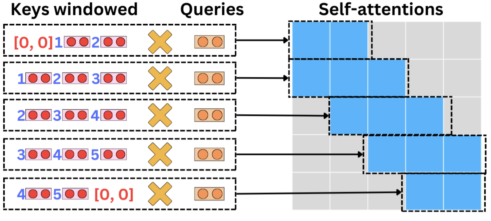
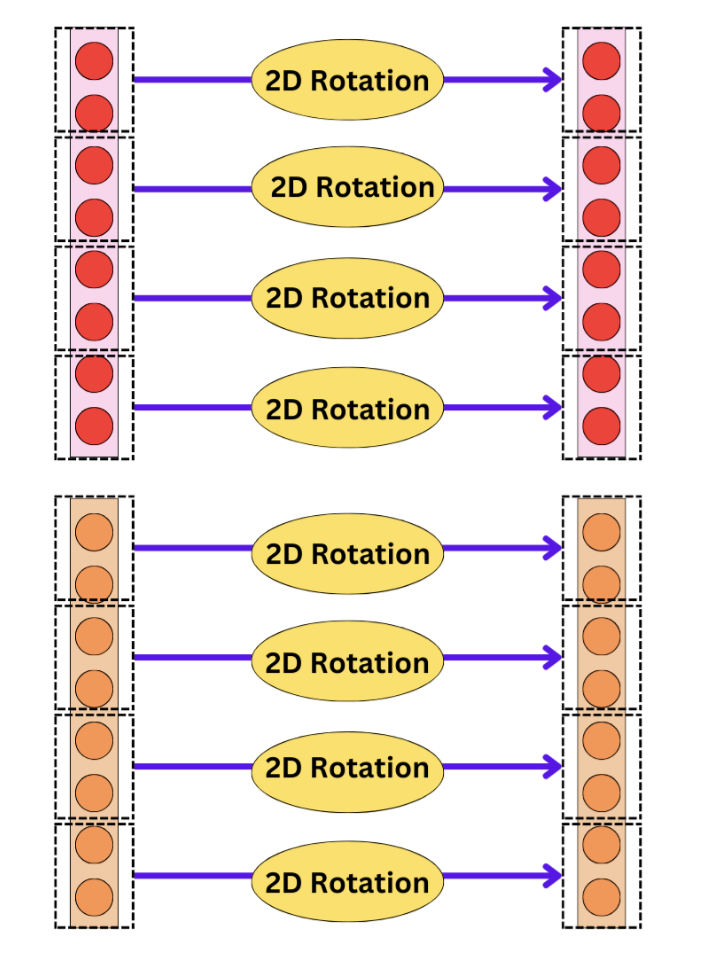

# A More Modern Implementation of the Transformer Architecture

The original Transformer architecture was proposed in 2017, and since then, many improvements have been made for the architectural to address the latency and throughput and addressing many challanges.

## Table of Contents

1. [Sparse Attention](#1-the-sparse-attention-layer)
2. [RoPE Embedding](#2-the-rope-embedding)
3. [SliGLU](#3-sliglu)
4. [The Mixture of Experts](#4-the-mixture-of-experts)
5. [RMSNorm](#5-rmsnorm)
6. [The Transformer Block](#6-the-transformer-block)


## 1. The Sparse Attention Layer

Many papers will claim that the Transformer architecture has a time complexity associated with the Attention layer that is quadratic in the number of inputs (∼O(N<sup>2</sup>)). While this is true for the architecture presented in the 2017 paper ["Attention Is All You Need"](https://arxiv.org/pdf/1706.03762.pdf), this isn't true for many modern implementations of the Transformation architecture. Many LLMs now utilize a sparse implementation of the Attention Layer.

For example, back in 2020, the [GPT-3 architecture](https://arxiv.org/pdf/2005.14165.pdf) was already using a [strided sparse attention mechanism](https://arxiv.org/pdf/1904.10509.pdf). [LLaMA 2](https://arxiv.org/pdf/2112.05682.pdf) even utilizes a multihead attention mechanism that requires [constant space complexity](https://arxiv.org/pdf/2112.05682.pdf). [Mistral 7B](https://arxiv.org/pdf/2310.06825.pdf) uses a sliding window attention, for example. In the following diagram, I am ignoring the concept of causality.


Let's implement a sliding window multihead attention layer. Even if, in the current attention layer, each query doesn't attend to all the other tokens, each hidden state contains information on the interactions between tokens within the window of the previous layers. If we have enough layers and a large enough sliding window, we can cover the whole context window:



One way to go about it is provided by the class `SlidingWindowMultiheadAttention`. The process is as follows for each sequence position:

  - Define the window range for keys and values based on the current position and window size.
  - Calculate the dot product (attention score) between the query at the current position and each key within the window.
  - Scale the score by the square root of the head dimension.
  - Apply softmax to the scores to obtain attention probabilities.
  - Multiply each attention probability by the corresponding value to get the weighted sum.
  - Update the context tensor at the current position with the weighted sum.
  - We pad keys and values to accommodate sliding window edges.

That works, but we don't make use of vectorization for the tensor operations! Let's implement `EfficientSlidingWindowMultiheadAttention`.

**Question 1** - In the forward function of `EfficientSlidingWindowMultiheadAttention`, compute the `keys`, `queries`, and `values`. Pad the keys and values to accommodate the sliding window edges.


### Unfolding the keys

We need to reshape the keys in a smart manner to be able to utilize tensor operations. We are going to use the function [unfold](https://pytorch.org/docs/stable/generated/torch.nn.Unfold.html). Let's try to understand how it works!

Let's say you have a sequence represented by a 1-dimensional tensor, and you want to apply a sliding window to extract subsequences (windows) of a specified size. For simplicity, let's consider a sequence of numbers from 1 to 10 and a window size

```python
import torch
# Sequence tensor
sequence = torch.arange(1, 11)  # Tensor: [1, 2, 3, 4, 5, 6, 7, 8, 9, 10]
print("Original Sequence:", sequence)
# Output: Original Sequence: tensor([ 1,  2,  3,  4,  5,  6,  7,  8,  9, 10])
```

The `unfold` method in PyTorch can be used to create sliding windows. You need to specify:

- The dimension along which to unfold (for a 1D tensor, this is dimension 0).
- The size of the window you want to extract (in this example, 3).
- The step size for each slide (for simplicity, let's use a step size of 1, meaning the window slides one element at a time).

```python
# Window size
window_size = 3
# Unfolding the sequence to create sliding windows
windows = sequence.unfold(0, window_size, 1)
print("Sliding Windows:\n", windows)
# Output: Sliding Windows:
#  tensor([[ 1,  2,  3],
#          [ 2,  3,  4],
#          [ 3,  4,  5],
#          [ 4,  5,  6],
#          [ 5,  6,  7],
#          [ 6,  7,  8],
#          [ 7,  8,  9],
#          [ 8,  9, 10]])
```

In the context of sliding window attention, each row of the resulting tensor from the unfold operation can be considered as the keys (and values) for computing attention scores for a query corresponding to the position at the center of the window. This allows the model to focus on a subset of the sequence, reducing computational complexity while capturing the local context around each position.

At this point, the size of `keys` is **[batch_size, num_heads, seq_length, head_dim]**. That means that in each of the **num_head** heads, we have **batch_size** samples of **seq_length** vectors of size **head_dim**. The size of **keys_padded** should be **[batch_size, num_heads, seq_length + 2 * padding, head_dim]**. We now want to create a `keys_windows` that has a dimension **[batch_size, num_heads, seq_length, head_dim, window_size]** by using the `unfold` function on `keys_padded`. Effectively, we going to replace one key vector of size **head_dim** by **widow_size** successive key vectors of size **head_dim**.


**Question 2** - Use the `unfold` function to create windowed versions of the `keys_padded` and `values_padded`.

With this new tensor, we can compute the self-attentions in one tensor operation.



Unfortunately, we cannot use the [bmm](https://pytorch.org/docs/stable/generated/torch.bmm.html) or [matmul](https://pytorch.org/docs/stable/generated/torch.matmul.html) functions to perform this operation. We are going to use the [torch.einsum](https://pytorch.org/docs/stable/generated/torch.einsum.html) function. The `torch.einsum` function allows for performing tensor operations using Einstein summation notation. This notation is a concise way to express complex tensor operations, including sums, products, contractions, and more, by specifying a formula that defines the pattern of these operations.

The Einstein notation simplifies expressions involving sums over tensors' indices. Here are the key principles:

- **Repeated Indices**: In an operation, any index that appears exactly twice indicates summation over that index.

- **Non-repeated Indices**: Indices that appear once represent dimensions in the output.

Examples:

Dot Product: The dot product between two vectors a and b can be represented as:

$$
c = \sum_{i} a_i b_i
$$

In Einstein's notation with `torch.einsum`, it translates to:

```python
c = torch.einsum('i,i->', a, b)
```

This specifies that for vectors *a* and *b*, indexed by *i*, we sum over *i* to produce a scalar *c*.

**Matrix Multiplication**: The multiplication of matrices *A* and *B* to produce matrix *C*, with dimensions corresponding to *A<sub>ij</sub>* and *B<sub>jk</sub>*, is:

$$
C_{ik} = \sum_j A_{ij} B_{jk}
$$

or if we assume summation on the indexes repeated twice:

$$
C_{ik} =  A_{ij} B_{jk}
$$

In `einsum` notation:

```python
C = torch.einsum('ij,jk->ik', A, B)
```

This operation multiplies matrices *A* and *B*, summing over the shared index *j* to produce *C*.

Batch Matrix Multiplication: For batched tensors, where each tensor *A* and *B*
includes a batch dimension *b*, along with *i,j,k* dimensions for matrix multiplication:

$$
C_{bik} = A_{bij} B_{bjk}
$$

In `einsum` notation:
```python
C = torch.einsum('bijk,bjk->bik', A, B)
```

**Question 3** - Using the `einsum` function, compute the tensor operation between the `queries` and the `keys_windows`. The resulting tensor should have a size of **[batch_size, num_heads, seq_length, window_size]**.

**Question 4** - Normalize the resulting tensor by **head_dim ** 0.5** and perform the softmax transformation.

**Question 5** - Using the `einsum` function, compute the tensor operation between the `attentions` and the `values_windows`. The resulting tensor should have a size **[batch_size, seq_length, num_heads, head_dim]**.

**Question 6** - reshape the resulting tensor into a tensor of size **[batch_size, seq_length, hidden_size]** and pass it through the last linear layer.

If w is the window size, we computed the attentions in *∼O(Nw)* instead of *∼O(N<sup>2</sup>)*!

Further improvement to consider:

- Gemini and Mistral 7B uses the Multi-query attention mechanism:

    https://arxiv.org/pdf/1911.02150.pdf
- Llama and Mistral use a memory-efficient attention mechanism: 
    
    https://arxiv.org/pdf/2112.05682.pdf
- Terraformer suggests that the last linear layer is unnecessary: 

    https://arxiv.org/pdf/2111.12763.pdf
- Take a look at the Mistral implementation: 
    
    https://github.com/mistralai/mistral-src/blob/main/mistral/model.py


## 2. The RoPE Embedding

Most modern LLMs are built using the RoPE ([Rotary Position Embedding](https://arxiv.org/pdf/2104.09864.pdf)) positional encoding. It offers a couple of advantages compared to the typical positional encoding:

- **Relative Position Encoding:** RoPE dynamically encodes relative positions through rotations, enabling models to capture sequence relationships without relying on static, absolute positional embeddings.
- **Generalizes to Variable Sequence Lengths:** Unlike traditional embeddings, RoPE naturally adapts to sequences of varying and unseen lengths, improving model flexibility and generalization.
- **Parameter Efficiency:** RoPE integrates positional information without additional learnable parameters, making it an efficient approach that simplifies model architecture.
- **Improved Interpretability:** The methodical integration of positional information through RoPE enhances the interpretability of how position influences attention and model decisions.
- **Support for Infinite Sequences:** RoPE's mathematical foundation allows for handling theoretically infinite sequence lengths, limited only by computational constraints, not architectural ones.

The idea of RoPE is that instead of adding a positional encoding to the semantic embeddings, we are going to 
rotate the keys and queries based on the position of the related tokens in the input sequences:


This will lead to the attentions containing the positional information. The values are NOT rotated, though. Therefore, the rotations only affect the weighted averages when we are performing the tensor operation between the values and the self-attentions.

To rotate a 2D vector *V* with an angle *θ*, we just need to apply the rotation matrix *R<sub>θ</sub>*:

$$
R_\theta = \begin{pmatrix}
\cos(\theta) & -\sin(\theta) \\
\sin(\theta) & \cos(\theta)
\end{pmatrix}
$$


with the new vector *V'*
  
$$
V' = R_\theta V
$$

So the trick is to find a way to apply that rotation to the keys and queries. Instead of extending this operation to vectors of higher dimensions, RoPE simply breaks down the vectors into pairs of elements and applies a pairwise 2D rotation to each of the pairs of elements:




For those rotations, the angle is not only dependent on the position *p* of the related token but also on the position *k* of the rotated segment within the vector. To make it simpler, we usually have θ<sub>pk</sub> = pθ<sub>k</sub>. So the whole rotation matrix becomes:

$$
R_\theta(p) = \begin{pmatrix}
\cos(p\theta_1) & -\sin(p\theta_1) & 0 & \cdots & 0 \\
\sin(p\theta_1) & \cos(p\theta_1) & 0 & \cdots & 0 \\
0 & 0 & \cos(p\theta_2) & -\sin(p\theta_2) & \cdots & 0 \\
0 & 0 & \sin(p\theta_2) & \cos(p\theta_2) & \cdots & 0 \\
\vdots & \vdots & \vdots & \vdots & \ddots & \vdots \\
0 & 0 & 0 & 0 & \cdots & \cos(p\theta_{\text{head\_dim}/2}) & -\sin(p\theta_{\text{head\_dim}/2}) \\
0 & 0 & 0 & 0 & \cdots & \sin(p\theta_{\text{head\_dim}/2}) & \cos(p\theta_{\text{head\_dim}/2})
\end{pmatrix}
$$

and we keep the transformation:

$$
V' = R_\theta(p) V
$$

But this matrix is a bit large, so we are going to use a couple of tricks to perform this operation efficiently. That is when it starts to be a bit abstract! We are going to pretend that each binary section of the vector are complex numbers

$$
 v= a+ib \\
 where \ i = \sqrt{-1}
$$


The nice thing about complex numbers is they behave very similarly to 2d vectors, and to rotate them by an angle *θ*, we just need to multiply them by *e<sup>iθ</sup>*:
$$
V' = V e^{i\theta}
$$

So, let's use this fact to compute the rotations efficiently. Let's implement the forward function of the RoPE class.

**Question 7** - We are going to isolate the pairs of elements by reshaping the keys and the queries. The queries and keys have an input dimension of **[batch_size, num_heads, seq_length, head_dim]**. Reshape them into **[batch_size, num_heads, seq_length, head_dim // 2 , 2**].

**Question 8** - Apply the [torch.view_as_complex](https://pytorch.org/docs/stable/generated/torch.view_as_complex.html) function to the queries and the keys. This will transform each segment of pairs of elements into a complex number. You should get a tensor of size **[batch_size, num_heads, seq_length, head_dim // 2]**.


The last two dimensions of `queries_complex` are **[..., seq_length, head_dim // 2]**, and the `rotation_matrix` has dimensions **[context_size, head_dim // 2]** where context_size is the maximum number of tokens expected by the model. Here, the rotation matrix represents $e^{i\theta_{pk}}$, where p is for the pth token and k is for the kth segment of pairs of elements. So we want to do something like:

$$
queries_rotated_{pk} = queries_complex_{pk}e^{i\theta_{pk}}
$$

**Question 9** - to do that, truncate the `rotation_matrix` to **seq_length** and multiply it to `queries_complex` and `key_complex`. This is an element-wise multiplication, so use the operation `'*'`. Even if the tensors don't have the same dimensions, the missing dimension in `rotation_matrix` will be broadcast to the other dimensions in `queries_complex` and `key_complex`, and the rotation will be applied to all the samples in the batch and all the heads.

Question 10 - use [torch.view_as_real](https://pytorch.org/docs/stable/generated/torch.view_as_real.html) to come back to a real (non-complex notation) and reshape the resulting tensor back to **[batch_size, num_heads, seq_length, head_dim]**.

Remains now to compute the rotation matrix with `get_rotation_matrix`. We are going to define a period 
*P*, because sin,cos,exp(i⋅) are periodic functions. Typically *P* is chosen as a large number greater than the context size (e.g. 10000). We are going to label *dim* to be the dimension (i.e. head_dim is our case!) of the vectors we are partitioning into *dim/2* segments of pairs. We are going to define:

$$
\theta_{pk} = \frac{p}{P^{2k/\text{dim}}}
$$

So we need to precompute *θ<sub>pk</sub>* for all p and k.

**Question 11** - use the function `torch.arange` to generate a tensor of frequencies:

$$
\text{freqs} = \left[ \frac{1}{P^{0/\text{dim}}}, \frac{1}{P^{2/\text{dim}}}, \cdots, \frac{1}{P^{2k/\text{dim}}}, \cdots, \frac{1}{P^{(\text{dim}-2)/\text{dim}}} \right]
$$

**Question 12** - use the function `torch.arange` to generate a tensor of token indexes:
$$
\text{token\_indexes} = [0, 1, \ldots, p, \ldots, \text{context\_size} - 1]
$$

**Question 13** - Use the function `torch.outer` to create a matrix `thetas` of size **[context_size, dim // 2]**.

**Question 14** - Use the function [torch.polar](https://pytorch.org/docs/stable/generated/torch.polar.html) to create the rotation matrix. It will effectively perform the *e<sup>i</sup>* operation on all the elements of the θ matrix.

$$
\text{rotation\_matrix} = \begin{pmatrix}
e^{i\theta_{11}} & e^{i\theta_{12}} & \cdots & e^{i\theta_{1\text{dim}/2}} \\
e^{i\theta_{21}} & e^{i\theta_{22}} & \cdots & e^{i\theta_{2\text{dim}/2}} \\
\vdots & \vdots & \ddots & \vdots \\
e^{i\theta_{p1}} & e^{i\theta_{p2}} & \cdots & e^{i\theta_{p\text{dim}/2}} \\
\vdots & \vdots & \ddots & \vdots \\
e^{i\theta_{c1}} & e^{i\theta_{c2}} & \cdots & e^{i\theta_{c\text{dim}/2}}
\end{pmatrix}
$$

Each of the Attention layers needs to be modified to rotate the queries and keys.

**Question 15** - modify `EfficientSlidingWindowMultiheadAttention` to include the RoPE positional embedding.


## 3. SliGLU

Today, many LLMs use the SiLU (Sigmoid Linear Unit) or the SiGLU (Sigmoid Gated Linear Unit) activation function.

<p align="center">
SiLU(x) = xσ(x)
</p>

where σ is the sigmoid function


$$
\text{SiGLU}(x) = (Wx + b)\sigma(W_gx + b_b)
$$

where σ is the sigmoid function, W,Wg are linear layers and b,bg are their respective biases. Those linear layers provide learnable parameters for the activation function to specialize to the specific input. Gated activation functions tend to boost the learning quality but worsen the stability of the training, especially with the Mixture of Experts layers.

PyTorch has its own implementation of [SiLU](https://pytorch.org/docs/stable/generated/torch.nn.SiLU.html), so let's implement SiGLU.

Question 16 - In activations.py, implement SiGLU without the bias terms. You will need 2 linear layers 
W,Wg, and you can use the `torch.sigmoid` function.

## 4. The Mixture of Experts


The Mixture of Experts architecture is by no means a new technique, but it has now become the default strategy for scaling LLMs. The typical transformer block is a succession of an attention layer, layer normalization, feed-forward layer, and another layer normalization. The strategy to scale transformers has been to just add more transformer blocks one after the other. The idea with MoE is to scale "horizontally" by adding more parallel feed-forward layers in each of the blocks. Those are the "experts".


Prior to the experts layer, we add a router so that each token only goes through a few experts. For example, we can have 64 experts, but with the token's hidden states only going through 2 of those. This ensures diverse learning while minimizing the computational load and, therefore, latency at inference time.


The router is just a linear layer that takes a hidden state and produces a vector with as many entries as there are experts. By using a softmax transformation, we get a probability for each of the experts. We can now use those probabilities to select the top-k experts and build a weighted average of the output of the selected experts. For example, if we take the top 2 experts:

<!-- New state= *P(FFN<sub>1</sub>)×FFN<sub>1</sub>(hidden state)+P(FFN<sub>2</sub>)×FFN<sub>2</sub>(hidden state)* -->

$$
   \text{New state} = P(\text{FFN}_1) \times \text{FFN}_1(\text{hidden state}) + P(\text{FFN}_2) \times \text{FFN}_2(\text{hidden state})
$$


Even with only the top-2 experts, the new output hidden state can represent a much richer set of information learned by the different combinations of experts. This also provides a very natural way to distribute the model computations across multiple GPU machines. Each machine can hold multiple experts, and the computations of the different experts can happen in parallel on the different machines.

However, training a MoE model is not trivial as it induces a lot of training instabilities. One difficulty is ensuring each expert sees enough data to learn the relevant statistical patterns. The typical strategy is adding a term to the loss function to provide a balanced data load across experts.

Let's implement a MoE layer. First, let's implement an expert similar to the ones used in Mistral-7B.

$$
\text{Expert}(x) = W_3 \cdot \text{SiGLU}(W_1(x) \cdot W_2(x))
$$

This is a feed-forward network with 3 linear layers and a SiLU or SiGLU activation function


**Question 17** - Implement the class `FeedForward` as an expert in moe.py.

In `MoeLayer`, we need experts and a gate as part of the router. The gate is a simple linear layer that can take tensors with input size **[batch_size, seq_length, hidden_size]** and produce a tensor of size **[batch_size, seq_length, num_experts]**.

**Question 18** - Instantiate the experts and the gate in the `__init__` function.

Let's implement the forward function.

**Question 19** - Pass the input tensor to the gate. The resulting tensor has a size **[batch_size, seq_length, num_experts]**. By using the [torch.topk](https://pytorch.org/docs/stable/generated/torch.topk.html) function, select the top experts. `n_experts_per_token` is the number of experts `topk` should select. If you don't pass an `dim` argument to `topk`, it is just going to select the last dimension. The resulting tensors are the top-k values of the input tensor and the indexes of the top-k. Those tensors should have a dimension **[batch_size, seq_length, n_experts_per_token]**.

**Question 20** - pass the top-k values to the softmax function to get the weights for each selected expert.

Now remains to establish the routing logic. We are going to iterate through the experts and use the [torch.where](https://pytorch.org/docs/stable/generated/torch.where.html) function to find the indexes of the hidden states that need to be routed to those experts.


For example, let's consider the expert with index 3. To find the position of all the hidden states that should be routed to expert #3, then I just need to do:

`batch_idx, token_idx, topk_idx = torch.where(selected_experts == 3)`

Now I can find the weights for all the hidden states for that expert:

```python
out[batch_idx, token_idx] += weights[batch_idx, token_idx, topk_idx, None] * expert(x[batch_idx, token_idx])
```

Here, the `weights` were computed with the softmax function and `selected_experts` came from the `topk` function. The `None` in `weights` add a new dimension necessary for the tensor operation to work.

**Question 21** - Iterate through the experts, find the indexes of the hidden states that should be routed to the current expert with its weights, and update the `out` tensor.


## 5. RMSNorm

In modern LLMs, the [RMSNorm layer](https://arxiv.org/pdf/1910.07467.pdf) (Root Mean Square Layer Normalization) became more prevalent than layer normalization. For example, both Llama and Mistral use this layer. It is simpler and more efficient than the typical layer normalization. The RMSNorm layer just normalizes the input by its root mean square:


$$
\tilde{x} = \frac{xw}{\sqrt{\frac{1}{n} \sum_{i=1}^{n} x_i}}
$$


Here, *w* is a learnable parameter of size **[hidden_size]** such that the network to undo the normalization if it is not optimal. The average is done on the hidden size dimension. This means we normalize each hidden state by the root mean square of the elements in that vector.

Question 22 - use [torch.rsqrt](https://pytorch.org/docs/stable/generated/torch.rsqrt.html) to implement `RMSNorm._norm`.

## 6. The Transformer Block

Since GPT-2, it has become common to put the normalization layers before the attention layer and the feed-forward network. It helps for the training stability. Also, most LLMs are decoder-only now.


**Question 23** - Implement the TransformerBlock class by replacing the layer normalization by the RMSNorm, the attention layer by the sliding window attention layer, and the feed-forward network by the Mixture of experts layer.

Remains to implement **Transformer** class! The transformer architecture is fairly simple:

1. The input embedding takes the token's indexes and generates hidden states. There are as many rows in that embedding as there are tokens in the vocabulary.
2. The hidden states are successively passed through the transformer blocks.
3. The last hidden states are passed through the language modeling head. The language modeling head is just a linear layer that maps from hidden size to vocabulary size to predict the logits of each of the tokens in the vocabulary.


We also need to compute the rotation matrix for RoPE.

**Question 24** - Instantiate the embedding, the transformer blocks, and the last linear layer, and implement the forward function.

You can test your code in `test_code.py`.